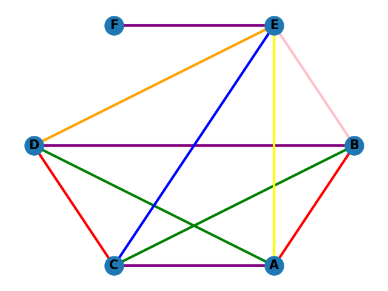

# coloring_graph
- Dùng networkx để tạo object Graph
- Dùng add_nod_from để add node 
- Dùng add_edge_from để add edge
- Node được gọi bằng G.nodes(). e.g: G.nodes = ['D', 'C', 'A', 'B', 'E', 'F']
- Node được gọi bằng G.edges() e.g: G.edges = [('D', 'B'), ('D', 'C'), ('D', 'A'), ('D', 'E'), ('C', 'A'), ('C', 'B'), ('C', 'E'), ('A', 'B'), ('A', 'E'), ('B', 'E'), ('E', 'F')]

Output của hàm greedy_edge_coloring là (1 dictionary có keys là cạnh (tuple của 2 đỉnh) và value là màu của cạnh đó) và max_color đã sử dụng
e.g: {('D', 'B'): 1, ('D', 'C'): 2, ('D', 'A'): 3, ('D', 'E'): 4, ('C', 'A'): 1, ('C', 'B'): 3, ('C', 'E'): 5, ('A', 'B'): 2, ('A', 'E'): 6, ('B', 'E'): 7, ('E', 'F'): 1}

||
|:--:| 
| *Demo* |
